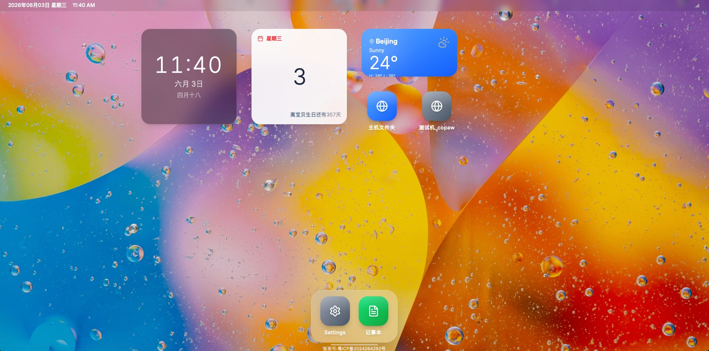

# My OS Home

**服务器端个人桌面应用 / Server-side Personal Desktop Application**

部署在自有服务器上的个人数字工作台，让你在任何设备上都能快速访问自己的笔记、AI 小应用和常用网站。所有数据私有存储，密码保护 + 防爆破机制确保只有你自己能用。

A personal digital workspace deployed on your own server, giving you quick access to your notes, AI mini-apps, and favorite websites from any device. All data is privately stored, with password protection and brute-force protection ensuring only you can access it.



---

## 产品简介 / About

### 这是什么？ / What is it?

My OS Home 是一个部署在你自己服务器上的**个人桌面应用**。它模拟了经典操作系统的桌面体验，让你可以在浏览器中拥有一个统一的个人工作台。

My OS Home is a **personal desktop application** deployed on your own server. It simulates a classic OS desktop experience, giving you a unified personal workspace right in your browser.

### 核心用途 / Core Use Cases

- **跨端信息存储** — 在任何设备上打开浏览器，就能访问你的笔记本、待办事项和个人数据，无需安装任何客户端
  **Cross-device Information Storage** — Open your browser on any device to access your notes, to-dos, and personal data without installing any client
- **个人应用聚合** — 将你用 AI 写的小应用、喜欢的网站、常用工具全部注册为桌面图标，一键打开
  **Personal App Aggregation** — Register your AI-built mini-apps, favorite websites, and常用 tools as desktop icons for one-click access
- **私有安全访问** — 密码认证 + IP 白名单 + 防爆破机制（5 次错误临时封禁 30 分钟，累计 3 次永久拉黑），确保只有你自己能用
  **Private & Secure Access** — Password authentication + IP whitelist + brute-force protection (5 failed attempts = 30min lock, 3 locks = permanent ban), ensuring only you can access it
- **代理浏览** — 内置代理浏览器，遇到被墙的网站可以直接通过服务器代理访问，无需额外配置
  **Proxy Browsing** — Built-in proxy browser lets you access blocked websites directly through your server, no extra configuration needed
- **AI 对话集成** — 可以将 AI 对话窗口作为应用安装到桌面上，通过代理浏览器直接使用
  **AI Chat Integration** — Install AI chat windows as desktop apps and use them directly through the proxy browser

---

## 核心特性 / Core Features

- **OS 桌面体验** — 桌面图标、Dock 栏、状态栏、小部件，还原经典桌面操作习惯
  **OS Desktop Experience** — Desktop icons, Dock bar, status bar, and widgets recreating classic desktop habits
- **跨端同步** — 部署在服务器上，手机、平板、电脑任何设备打开浏览器即用
  **Cross-device Sync** — Deployed on a server, works on any device with a browser — phone, tablet, or computer
- **记事本** — 轻量笔记功能，支持 Markdown 格式，随时记录灵感
  **Notepad** — Lightweight note-taking with Markdown support, capture ideas anytime
- **动态应用配置** — 后端 API 管理桌面应用，添加/删除应用无需重新构建前端
  **Dynamic App Configuration** — Backend API manages desktop apps, add/remove apps without rebuilding the frontend
- **安全防护** — Token 认证 + IP 白名单 + 防爆破机制（5 次错误临时封禁 30 分钟，累计 3 次封禁永久拉黑）
  **Security Protection** — Token authentication + IP whitelist + brute-force protection (5 failed attempts = 30min lock, 3 locks = permanent ban)
- **代理浏览器** — 内置代理功能，可访问被墙网站，支持 AI 对话窗口集成
  **Proxy Browser** — Built-in proxy for accessing blocked websites, supports AI chat window integration
- **数据持久化** — SQLite 存储安全数据，重启不丢失
  **Data Persistence** — SQLite storage for security data, survives restarts

---

## 项目结构 / Project Structure

```
my-os-home/
├── components/           # 组件目录 / Components
│   ├── AppIcon/          # 应用图标组件 / App icon component
│   ├── Background/       # 背景组件 / Background component
│   ├── Desktop/          # 桌面组件 / Desktop component
│   ├── Dock/             # Dock栏组件 / Dock bar component
│   ├── NoteApp/          # 记事本应用组件 / Notepad app component
│   ├── PasswordModal/    # 密码模态框组件 / Password modal component
│   ├── ProxyBrowser/     # 内置浏览器组件 / Built-in browser component
│   ├── Settings/         # 设置应用组件 / Settings app component
│   ├── StatusBar/        # 状态栏组件 / Status bar component
│   └── Widgets/          # 小部件组件 / Widget components
│       ├── CalendarWidget/  # 日历小部件 / Calendar widget
│       ├── ClockWidget/     # 时钟小部件 / Clock widget
│       └── WeatherWidget/   # 天气小部件 / Weather widget
├── src/                  # 源代码目录 / Source code
│   └── index.css         # 全局样式 / Global styles
├── backend/              # 后端目录 / Backend
│   ├── app/              # 后端应用 / Backend app
│   │   ├── models/       # 数据模型 / Data models
│   │   ├── routes/       # 路由 / Routes
│   │   └── services/     # 业务逻辑 / Business logic
│   ├── config/           # 配置文件 / Configuration
│   ├── .env              # 环境变量 / Environment variables
│   ├── app.py            # 后端主应用 / Main backend app
│   ├── requirements.txt  # 后端依赖 / Backend dependencies
│   └── run.py            # 后端启动文件 / Backend startup file
├── App.tsx               # 应用主组件 / Main app component
├── constants.tsx         # 应用配置常量 / App configuration constants
── types.ts              # TypeScript类型定义 / TypeScript type definitions
├── package.json          # 项目配置和依赖 / Project config and dependencies
└── vite.config.ts        # Vite配置 / Vite configuration
```

---

## 已配置应用 / Configured Apps

### 常用应用 / Common Apps

- **贷款规划器 / Loan Planner**：个人财务规划工具 / Personal financial planning tool
- **GitHub**：代码托管平台（支持密码保护）/ Code hosting platform (password-protected)
- **Safari**：网络浏览器 / Web browser
- **Mail**：邮件客户端 / Email client
- **Photos**：图片浏览（链接到Unsplash）/ Photo browsing (links to Unsplash)
- **音乐 / Music**：在线音乐播放器（链接到网易云音乐）/ Online music player (links to NetEase Cloud Music)
- **Settings**：系统设置 / System settings
- **Blog**：个人博客 / Personal blog

---

## 快速开始 / Quick Start

### 前提条件 / Prerequisites

- **前端 / Frontend**：Node.js (v18+), npm 或 pnpm
- **后端 / Backend**：Python 3.7+, pip

### 安装和运行 / Installation & Running

#### 前端 / Frontend

1. **克隆项目 / Clone the project**

   ```bash
   git clone <repository-url>
   cd my-os-home
   ```
2. **安装前端依赖 / Install frontend dependencies**

   ```bash
   npm install
   # 或 / or
   pnpm install
   ```
3. **启动前端开发服务器 / Start frontend dev server**

   ```bash
   npm run dev
   # 或 / or
   pnpm run dev
   ```
4. **构建前端生产版本 / Build frontend production version**

   ```bash
   npm run build
   # 或 / or
   pnpm run build
   ```
5. **预览前端生产构建 / Preview frontend production build**

   ```bash
   npm run preview
   # 或 / or
   pnpm run preview
   ```

#### 后端 / Backend

1. **进入后端目录 / Enter backend directory**

   ```bash
   cd backend
   ```
2. **安装后端依赖 / Install backend dependencies**

   ```bash
   pip install -r requirements.txt
   ```
3. **启动后端服务器 / Start backend server**

   ```bash
   python run.py
   ```

   后端服务器默认运行在 `http://localhost:5100`。
   The backend server runs at `http://localhost:5100` by default.

---

## 自定义配置 / Custom Configuration

### 添加新应用 / Add New Apps

要添加新应用，只需在 `constants.tsx` 文件中的 `APPS` 数组中添加新的应用配置对象：
To add a new app, simply add a new app configuration object to the `APPS` array in `constants.tsx`:

```typescript
{
  id: 'app-id',           // 应用唯一标识符 / Unique app identifier
  name: '应用名称',        // 应用显示名称 / Display name
  url: 'https://example.com', // 应用链接 / App URL
  icon: <IconComponent color="white" size={32} />, // 应用图标 / App icon
  color: 'from-blue-400 to-blue-600', // 应用颜色主题 / App color theme
  isDock: true,           // 是否显示在Dock栏 / Show in Dock bar
  useVPN: false,          // 是否使用内置浏览器打开 / Use built-in browser
  requiresPassword: false // 是否需要密码认证 / Require password authentication
}
```

### 自定义背景 / Custom Background

背景配置位于 `components/Background` 组件中，您可以根据需要修改渐变效果或添加自定义背景图片。
Background configuration is in the `components/Background` component. You can modify gradient effects or add custom background images as needed.

### 调整小部件 / Adjust Widgets

小部件配置位于 `components/Widgets` 目录下，您可以根据需要修改或添加新的小部件。
Widget configurations are in the `components/Widgets` directory. You can modify or add new widgets as needed.

---

## 技术栈 / Tech Stack

### 前端 / Frontend

| 技术 / Tech  | 版本 / Version | 用途 / Purpose                |
| ------------ | -------------- | ----------------------------- |
| React        | 19.2.4         | 前端框架 / Frontend framework |
| TypeScript   | ~5.8.2         | 类型系统 / Type system        |
| Tailwind CSS | ^4.1.18        | CSS框架 / CSS framework       |
| Vite         | ^6.2.0         | 构建工具 / Build tool         |
| Lucide React | ^0.563.0       | 图标库 / Icon library         |
| date-fns     | ^4.1.0         | 日期处理 / Date handling      |

### 后端 / Backend

| 技术 / Tech   | 用途 / Purpose                              |
| ------------- | ------------------------------------------- |
| Python        | 后端编程语言 / Backend programming language |
| Flask         | Web框架 / Web framework                     |
| Flask-CORS    | 处理跨域请求 / Handle cross-origin requests |
| python-dotenv | 加载环境变量 / Load environment variables   |

---

## 浏览器兼容性 / Browser Compatibility

- Chrome 90+
- Firefox 88+
- Safari 14+
- Edge 90+

---

## 许可证 / License

本项目采用 MIT 许可证 - 详见 [LICENSE](LICENSE) 文件
This project is licensed under the MIT License - see the [LICENSE](LICENSE) file for details.

---

## 贡献 / Contributing

欢迎提交 Issue 和 Pull Request 来改进这个项目！
Issues and Pull Requests are welcome to improve this project!

---

## 致谢 / Acknowledgments

- 感谢 React 团队提供优秀的前端框架 / Thanks to the React team for the excellent frontend framework
- 感谢 Tailwind CSS 团队提供便捷的样式解决方案 / Thanks to the Tailwind CSS team for the convenient styling solution
- 感谢 Lucide 团队提供精美的图标库 / Thanks to the Lucide team for the beautiful icon library
- 感谢所有为这个项目做出贡献的开发者 / Thanks to all developers who have contributed to this project

---

**享受您的个人OS风格主页！ / Enjoy your personal OS-style homepage!** 🎉
